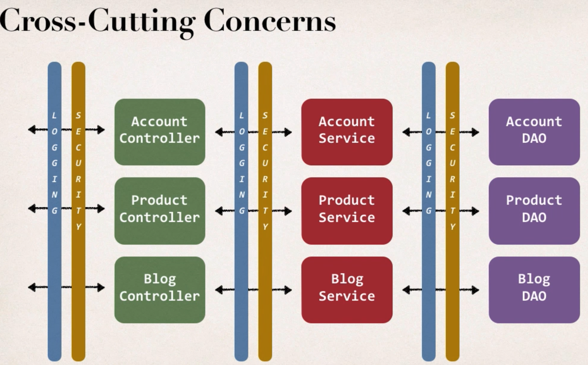
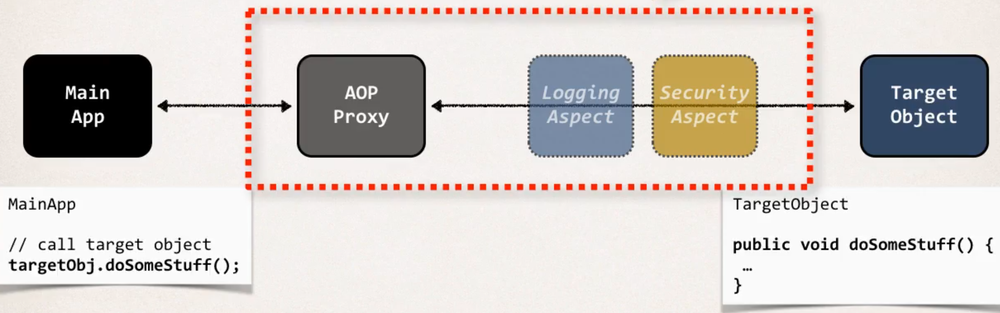

# Aspect Oriented Programming (AOP)

* This is basic hibernate code as we did before to save an entity:

````java
@Override
public void addAccount(Account theAccount, String userId) {
    Session session = sessionFactory.getCurrentSession();
    session.save(theAccount);
}
````

* Now we have some new requirements from the boss, to add some logging.
  * Need to log our DAO method

````java
@Override
public void addAccount(Account theAccount, String userId) {
    // add logging (println, log4j, etc.)
        
    Session session = sessionFactory.getCurrentSession();
    session.save(theAccount);
}
````

* New requirement comes in:
  * Need to add security to our DAO before running the method

````java
@Override
public void addAccount(Account theAccount, String userId) {
    // add logging (println, log4j, etc.)
        
    // add security check
        
    Session session = sessionFactory.getCurrentSession();
    session.save(theAccount);
}
````

* New requirement comes in:
  * Let's add this to Controller, Service also

...

* New requirement comes in:
  * Add this to our entire system

...

## Problem statement

* **Code Tangling**: We have logging and security code tangled in that specific business method, which is not good
* **Code Scattering**: We have to update all classes if changes to logging logic is required

## Possible Solution

* Inheritance? (no)
  * We still would need to go through all our classes and put "extends" in
  * What if they already extend from another class -> no multiple inheritance allowed in Java
* Delegation? (no)
  * Same as above - need to touch all classes
* Aspect-Oriented Programming (yes)
  * An Aspect encapsulates **Cross-Cutting Concerns**
  * An Aspect can be reused at multiple locations, and it's basically just a class



## AOP Solution
* Apply the Proxy design pattern
  * The ``Main App`` simply going to make a method-call, it has no idea about ``AOP Proxy
* Everything happens behind the scene (like a spy)



### Benefits
* Code for Aspect is defined in a single class
* Business code is cleaner
* Configurable (Can apply to different parts of app, no need to change main)

### Disadvantages
* Too many Aspects make app flow hard to follow
* Minor performance cost

### AOP Use Cases
* Logging, Security, Transaction
* Exception Handling
* API Management
* ...


## AOP Terminology
* **Aspect**: Module of code for cross-cutting-concerns (logging, security, ...)
* **Advice**: What action is taken and when should be applied
* **Join Point**: When to apply code during program execution
* **Pointcut**: A predicate expression for where advice should be applied

### Advice Types
* **Before advice**: Run before the method
* **After finally advice**: Run after the method
* **After returning advice**: Run after the method (on success)
* **After throwing advice**: Run after the method (on exception)
* **Around advice**: Run before and after method

### Weaving
* Connecting aspects to target objects to create an advised object
* Compile-time, load-time, run-time (slowest) weaving

### AOP Frameworks
* **Spring AOP** (easier to use, lightweight)
  * Only method-level join points
  * Uses proxy pattern
  * Security, Transactions, Caching
  * Uses run-time weaving of aspects
* **AspectJ** (better for complex requirements)
  * Support all join points
  * Complete support for AOP
  * Compile-time, post-compile, load-time weaving

