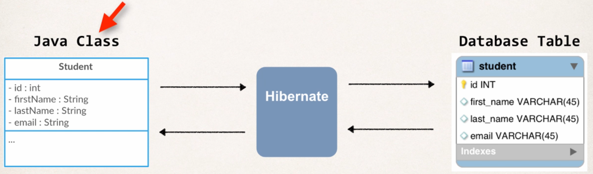

# Hibernate
* A framework for persisting or saving Java objects in a database
* You Java app -> Hibernate -> Database
* Handles all of the low level SQL code
* Minimizes JDBC code you have to develop and provides ORM

## ORM
* Developer defines mapping between Java class and database table



````java
// create object
Student theStudent = new Student("John", "Doe");

// save it to DB and returns ID
int theId = (Integer) session.save(theStudent);

// retrieve from DB
Student myStudent = session.get(Student.class, theId);

// query objects
Query query = session.createQuery("from student"); // Hibernate Query Language

List<Student> students = query.list();
````

## Hibernate & JDBC Relationship
* Hibernate uses JDBC for all Database communications (its just another layer of abstraction)

## Hibernate Development process
1. Add Hibernate config file
2. Annotate Java Class
3. Develop Java code to perform DB operations

Add Hibernate config file. It tells Hibernate how to connect to the DB

````xml
<hibernate-configuration>

    <session-factory>

        <!-- JDBC Database connection settings -->
        <property name="connection.driver_class">com.mysql.cj.jdbc.Driver</property>
        <property name="connection.url">jdbc:mysql://localhost:3306/hb_student_tracker?useSSL=false&amp;serverTimezone=UTC</property>
        <property name="connection.username">hbstudent</property>
        <property name="connection.password">hbstudent</property>

        <!-- JDBC connection pool settings ... using built-in test pool -->
        <property name="connection.pool_size">1</property>

        <!-- Select our SQL dialect -->
        <property name="dialect">org.hibernate.dialect.MySQLDialect</property>

        <!-- Echo the SQL to stdout -->
        <property name="show_sql">true</property>

		<!-- Set the current session context -->
		<property name="current_session_context_class">thread</property>
 
    </session-factory>

</hibernate-configuration>
````

Annotate Java Class. Entity Class = Java class that is mapped to DB table
1. XML config (legacy)
2. Java Annotations (prefered)

````java
@Entity
@Table(name="student")
public class Student {
    @Id // PK
    @GeneratedValue(strategy=GenerationType.IDENTITY) // PK if you wanna be explicit
    @GeneratedValue(strategy=GenerationType.AUTO)
    @GeneratedValue(strategy=GenerationType.SEQUENCE)
    @GeneratedValue(strategy=GenerationType.TABLE)
    @Column(name="id")
    private int id;

    @Column(name="first_name")
    private String firstName;
}
````

Develop Java code to perform DB operations

* ``SessionFactory``: Reads the hibernate config file, creates session objects, only create once in your app
* ``Session``: Wraps a JDBC connection, Main object to save/retrieve objects, retrieved from SessionFactory, short-lived object (use it and then throw it away)

````java
SessionFactory = factory = new Configuration()
        .configure("hibernate.cfg.xm")
        .addAnnotatedClass(Student.class)
        .buildSessionFactory();

Session session = factory.getCurrentSession();

try {
        // create student object
        Student tempStudent = new Student();
        
        // start transaction (hibernate knows how to map this object based on our annotion)
        session.beginTransaction();
        
        // save the student
        session.save(tempStudent);
        
        // commit the transaction
        session.getTransaction().commit();
} finally {
    factory.close();
}
````

## Retrieve an object
* In hibernate we retrieve objects by its ID (Primary Key)

````java
Student myStudent = session.get(Student.class, theStudent.getId());
````

### Querying Objects
* Using HQL, similar to SQL

````java
// use the Java class name here
List<Student> theStudents = session.createQuery("from Student").getResultList();

List<Student> theStudents = session.createQuery("from Student s where s.lastName='Doe'").getResultList();
````

## Updating Objects

````java
int studentId = 1;
Student myStudent = session.get(Student.class, studentId);

myStudent.setFirstName("Scooby");

session.getTransaction().commit();
````

For multiple updates:
````java
session.createQuery("update Student set email='foo@gmail.com'").executeUpdate();
````

## Deleting Objects
````java
int studentId = 1;
Student myStudent = session.get(Student.class, studentId);

session.delete(myStudent);

session.getTransaction().commit();
````

For multiple deletions:
````java
session.createQuery("delete from Student where id=2").executeUpdate();
````

## Advanced Mappings
* 1:n, n:m, etc.
* PK and FK
* CASCADE, ...

### 1:1 mapping

Create ``InstructorDetail`` table
````java
@Entity
@Table(name="instructor_detail")
public class InstructorDetail {
    @Id
    @GeneratedValue(strategy=GenerationType.IDENTITY)
    @Column(name="id")
    private int id;
    
    ...
}
````

Create ``Instructor`` table and map to ``InstructorDetail``

````java
@Entity
@Table(name="instructor")
public class Instructor {
    @Id
    @GeneratedValue(strategy=GenerationType.IDENTITY)
    @Column(name="id")
    private int id;
    
    @OneToOne(cascade=CascadeType.ALL)
    @JoinColumn(name="instructor_detail_id")
    private InstructorDetail instructorDetail;
    
    ...
    
}
````

Create Main App

````java
public static void main(String[] args) {
    Instructor tempInstructor = new Instructor("Max", "Musterman", "maxmuster@gmail.com");
    InstructorDetail tempInstructorDetail = new InstructorDetail("http://www.example.com", "Heyya!");
    
    tempInstructor.setInstructorDetail(tempInstructorDetail);
    
    session.beginTransaction();
    session.save(tempInstructor);
    session.getTransaction().commit();
}
````

### 1:1 Bi-Directional
* If we load an InstructorDetail, we want to get the associated Instructor
* Cant do this with our uni-directional setup

Changes to ``InstructorDetail``
````java
@Entity
@Table(name = "instructor_detail")
public class InstructorDetail {

    @OneToOne(mappedBy = "instructorDetail", cascade=CascadeType.ALL) // refers to the instructorDetail property in Instructor.class
    private Instructor instructor;

    public Instructor getInstructor() {
        return instructor;
    }

    public void setInstructor(Instructor instructor) {
        this.instructor = instructor;
    }
}
````

Create Main App
````java
public static void main(String [] args) {
        int theId = 1;
        InstructorDetail = temp = session.get(InstructorDetail.class, theId);

        Sysout(temp.getInstructor());
        }
````

## STOPED AT LECTURE 23, VIDEO 12

