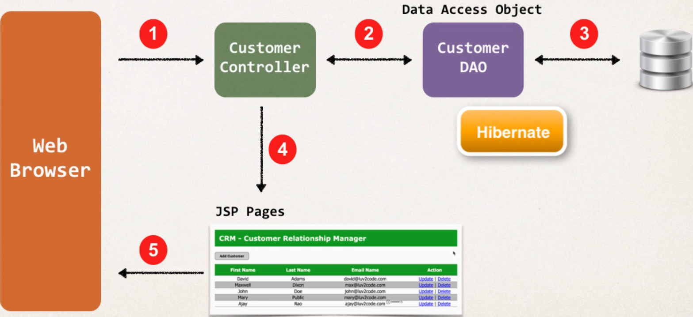
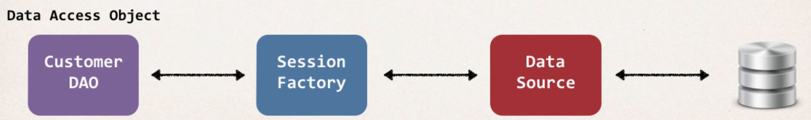
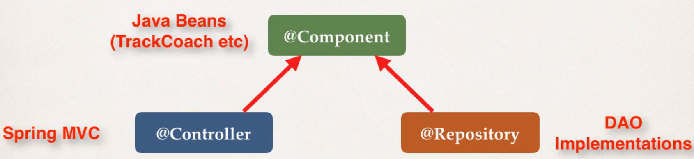
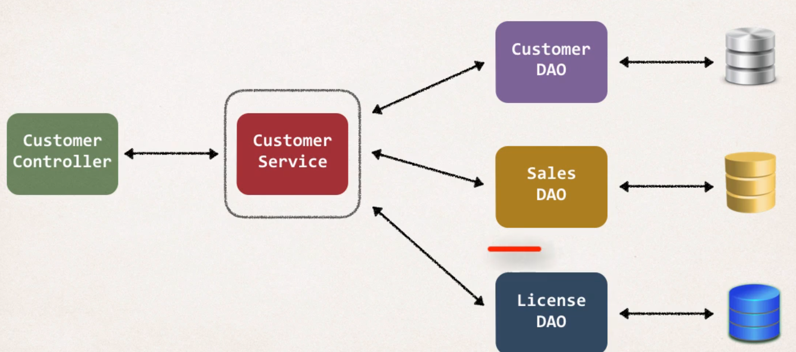

# Hibernate & MVC Project
* Build a CRM System

## Development Process
* Create tables (see SQL scripts)
* Add JDBC Driver for MySQL (to ``WEB-INF/lib/mysql-connector.jar``)
* Copy over ``web.xml`` and ``spring-mvc-crud-demo-servlet.xml`` as starter files
* Sanity test to make sure we can connect to DB

## Big Picture
* Our DAO will make use of the Hibernate API for accessing data and sending it back to the controller
* This DAO object will have methods for
  * ``saveCustomer()``
  * ``getCustomer()``
  * ``updateCustomer()``
  * ``deleteCustomer()``



### Listing customers
* Create ``Customer.java`` entity class
* Create ``CustomerDAO.java`` + ``CustomerDAOImpl.java``
* Create ``CustomerController.java``
* Create JSP page ``list-customer.jsp``

### Create ``Customer.java`` entity class

````java
@Entity
@Table(name = "customer")
public class Customer {

    @Id
    @Column(name = "id")
    private int id;

    @Column(name = "firstName")
    private String firstName;
    
  ...
````

Remember: How will Hibernate or Spring know about our entity classes?

``spring-mvc-crud-demo-servlet.xml``

````xml
<bean id="sessionFactory"
	class="org.springframework.orm.hibernate5.LocalSessionFactoryBean">
	<property name="dataSource" ref="myDataSource" />
	<property name="packagesToScan" value="com.dstoecklein.springdemo.entity" />
    ...
````

### Create ``CustomerDAO.java`` + ``CustomerDAOImpl.java``
* For Hibernate our DAO needs a ``SessionFactory``
* Factory needs a data source (how connect to DB etc.)
* All of these are dependencies, so we can use dependency injection here

``spring-mvc-crud-demo-servlet.xml``
````xml
<bean id="myDataSource" class="com.mchange.v2.c3p0.ComboPooledDataSource"
      destroy-method="close">
  <property name="driverClass" value="com.mysql.cj.jdbc.Driver" />
  <property name="jdbcUrl" value="jdbc:mysql://localhost:3306/web_customer_tracker?useSSL=false&amp;serverTimezone=UTC" />
  <property name="user" value="hbstudent" />
  <property name="password" value="hbstudent" />
  ...
````

````xml
<bean id="sessionFactory"
		class="org.springframework.orm.hibernate5.LocalSessionFactoryBean">
		<property name="dataSource" ref="myDataSource" />
...
````



Define the DAO interface

````java
public interface CustomerDAO {
    public List<Customer> getCustomers();
}
````

Define DAO implementation

````java
public class CustomerDAOImp implements CustomerDAO {
    @Autowired
    private SessionFactory sessionFactory;
    
    public List<Customer> getCustomers() {
      ...
    }
}
````

* Spring provides this special annotation ``@Transactional`` to automatically begin and end a transaction for your hibernate code
* No need for stuff like ``session.beginTransaction()`` or ``session.getTransaction().commit();``

````java
public class CustomerDAOImp implements CustomerDAO {
    @Autowired
    private SessionFactory sessionFactory;
    
    @Transactional
    public List<Customer> getCustomers() {
        Session currentSession = sessionFactory.getCurrentSession();
        
        Query<Custoer> theQuery = currentSession.createQuery("from Customer", Customer.class);
        
        List<Customer> customers = theQuery.getResultList();
        
        return customers;
    }
}
````

* Spring has another special annotation ``@Repository`` for DAOs
* Place at the Top of the DAO implementation
* Spring will automatically register the DAO implementation
* Spring will provide translation of any JDBC related exceptions



````java
@Repository
public class CustomerDAOImpl implements CustomerDAO {
    @Autowired
    private SessionFactory sessionFactory;
    
    @Transactional
    public List<Customer> getCustomers() {
        Session currentSession = sessionFactory.getCurrentSession();
        
        Query<Custoer> theQuery = currentSession.createQuery("from Customer", Customer.class);

        return theQuery.getResultList();
    }
}
````

### Create ``CustomerController.java``
* Inject DAO into controller
* Remember: Spring gonna scan for components that implements the ``CustomerDAO`` interface

````java
@Controller
@RequestMapping("/customer")
public class CustomerController {

    // inject customer DAO
    @Autowired
    private CustomerDAO customerDAO;

    @RequestMapping("/list")
    public String listCustomers(Model theModel) {
        
        // get customer from DAO
        List<Customer> theCustomers = customerDAO.getCustomers();
        
        // add customers to the mode
        theModel.addAttribute("customers", theCustomers);
        
        return "list-customers";
    }
}
````

### Create JSP page ``list-customer.jsp``

...

### Adding CSS

````xml
<!-- Add support for reading web resources: css, images, js, etc ... -->
<mvc:resources location="/resources/" mapping="/resources/**"/>
````

### Add Welcome File
* Configured in ``web.xml``

## ``@GetMapping`` & ``@PostMapping``
* On HTML Form we add something like

````html
<form action=""processForm" method="GET" ...>
````

* What we did so far is to use ``@RequestMapping()`` which actually handles **ALL HTTP** methods (GET, POST, PUT, ...)
````java
@RequestMapping("/processForm")
public String processForm(...) {
        ...
}
````

* We can constraint the mapping by using 
````java
@RequestMapping("/processForm", method=RequestMethod.GET)
public String processForm(...) {
        ...
}
````

* With ``@GetMapping`` & ``@PostMapping`` we can shortcut the above mapping

````java
@GetMapping("/processForm")
public String processForm(...) {
        ...
}
````

### When to use what
* ``GET``: Good for debugging, limitations on data length, can bookmark the URL
* ``POST``: no limitations on data length, can send bindary data, cant bookmark the URL

## ``@Service`` Annotation
* Refactor: Add a service layer which sits between our controller and DAO
* The purpose: Implementation of **Service Facade** design pattern, able to integrate data from multiple sources
* ``@Service`` also inherits from ``@Component``
* Its applied to the Service implementation



### Development process
* Define Service interface
* Define Service implementation
  * Inject DAO

Define Service interface
````java
public interface CustomerService {
    public List<Customer> getCustomers();
}
````

Define Service implementation
````java
@Service
public class CustomerServiceImpl implements CustomerService {
    @Autowired
    private CustomerDAO customerDAO;
    
    @Transactional
    public List<Customer> getCustomers() {
      ...
    }
}
````

* We also move the ``@Transactional`` part to our service, because our Service define the begin and end of a given transaction.

````java
@Repository
public class CustomerDAOImpl implements CustomerDAO {

  // inject dependency
  @Autowired
  private SessionFactory sessionFactory;

  @Override
  public List<Customer> getCustomers() {

    // get current hibernate session
    Session currentSession = sessionFactory.getCurrentSession();

    // create query
    Query<Customer> theQuery = currentSession.createQuery("from Customer", Customer.class);

    return theQuery.getResultList();
  }
}
````

* Modification to Controller to use customerService instead of DAO.

````java
@Controller
@RequestMapping("/customer")
public class CustomerController {

    @Autowired
    private CustomerService customerService;

    @GetMapping("/list")
    public String listCustomers(Model theModel) {

        // get customer from DAO
        List<Customer> theCustomers = customerService.getCustomers();

        // add customers to the model
        theModel.addAttribute("customers", theCustomers);

        return "list-customers";
    }
}
````

## Add a Customer
* Update ``list-customer.jsp``
* Create HTML for new customer
* Process Form data: Controller -> Service -> DAO

Update ``list-customer.jsp``

````html
<!-- new button: Add customer -->
<input type="button" value="Add Customer" 
       onclick="window.location.href='showFormForAdd'" ; return false; 
       class="add-button"
/>
````

Create HTML for new customer

``CustomerController.java``
````java
@GetMapping("/showFormForAdd")
public String showFormForAdd(Model theModel) {

    Customer theCustomer = new Customer();

    theModel.addAttribute("customer", theCustomer);

    return "customer-form";
}
````

``customer-form.jsp``
````html
<%@ taglib prefix="form" uri="http://www.springframework.org/tags/form" %>

<html>
<head>
  <title>Save Customer</title>

  <link type="text/css"
        rel="stylesheet"
        href="${pageContext.request.contextPath}/resources/css/style.css"
  />

  <link type="text/css"
        rel="stylesheet"
        href="${pageContext.request.contextPath}/resources/css/add-customer-style.css"
  />
</head>

<body>
<div id="wrapper">
  <div id="header">
    <h2>CRM - Customer Relationship Manager</h2>
  </div>
</div>

<div id="container">
  <h3>Save Customer</h3>

  <form:form action="saveCustomer" modelAttribute="customer" method="post">
    <table>
      <tbody>
      <tr>
        <td><label>First name:</label></td>
        <td><form:input path="firstName" /></td>

        <td><label>Last name:</label></td>
        <td><form:input path="lastName" /></td>

        <td><label>Email:</label></td>
        <td><form:input path="email" /></td>

        <td><label></label></td>
        <td><input type="submit" value="Save" class="save" /></td>
      </tr>
      </tbody>
    </table>
  </form:form>

  <div style="clear: both"></div>

  <p>
    <a href="${pageContext.request.contextPath}/customer/list">Back to List</a>
  </p>

</div>
</body>

</html>
````

Process Form data: Controller -> Service -> DAO

``CustomerService.java``
````java
public interface CustomerService {
    public List<Customer> getCustomers();

    public void saveCustomer(Customer theCustomer);
}

````

``CustomerServiceImpl.java``
````java
@Override
@Transactional
public void saveCustomer(Customer theCustomer) {
    customerDAO.saveCustomer(theCustomer);
}
````

``CustomerDAO.java``
````java
public interface CustomerDAO {
    public List<Customer> getCustomers();

    public void saveCustomer(Customer theCustomer);
}
````

``CustomerDAOImpl.java``
````java
@Override
public void saveCustomer(Customer theCustomer) {

    Session currentSession = sessionFactory.getCurrentSession();
        
    currentSession.save(theCustomer);
}
````

``CustomerController.java``

````java
@PostMapping("/saveCustomer")
public String saveCustomer(@ModelAttribute("customer") Customer theCustomer) {
    
    customerService.saveCustomer(theCustomer);
    
    return "redirect:/customer/list";
}
````

### Sort Customer by last name

``CustomerDAOImpl.java``
````java
Query<Customer> theQuery = currentSession.createQuery("from Customer order by lastName", Customer.class);
````

## Update Customer

``customer-form.jsp``
* Update so that it handles params ``customerId``:
  * ``http://localhost:8080/web-customer-tracker/customer/showFormUpdate?customerId=1``
````html
...
    <th>Action</th>
...
  <!-- loop over and print our customers -->
  <c:forEach var="tempCustomer" items="${customers}">
  
    <!-- construct update link with customer id -->
    <c:url var="updateLink" value="/customer/showFormForUpdate">
      <:c:param name="customerId" value="${tempCustomer.id}" />
    </c:url>
  
    <tr>
      <td> ${tempCustomer.firstName} </td>
      <td> ${tempCustomer.lastName} </td>
      <td> ${tempCustomer.email} </td>
      <td>
        <a href="${updateLink}">Update</a>
      </td>
    </tr>
  
  </c:forEach>
...
````

``CustomerService.java``
````java
public interface CustomerService {
    public List<Customer> getCustomers();
  
    public void saveCustomer(Customer theCustomer);
  
    public Customer getCustomer(int theId);
}
````

``CustomerServiceImpl.java``
````java
@Override
@Transactional
public Customer getCustomer(int theId) {
    return customerDAO.getCustomer(theId);
}
````

``CustomerDAO.java``
````java
public interface CustomerDAO {
    public List<Customer> getCustomers();
  
    public void saveCustomer(Customer theCustomer);
  
    public Customer getCustomer(int theId);
}
````

``CustomerDAOImpl.java``
````java
@Override
public Customer getCustomer(int theId) {

    Session currentSession = sessionFactory.getCurrentSession();

    Customer theCustomer = currentSession.get(Customer.class, theId);

    return theCustomer;
}
````

``CustomerController.java``

````java
@GetMapping("/showFormForUpdate")
public String showFormForUpdate(@RequestParam("customerId") int theId, Model theModel) {

    Customer theCustomer = customerService.getCustomer(theId);

    theModel.addAttribute("customer", theCustomer);
    
    return "customer-form";
}
````

### Save customer to DB

``customer-form.jsp``
* When form is loaded, Spring will do ``customer.get(id)`` and place it in hidden form field
* Then when we do a submit, Spring will submit this data by saying ``customer.set(id)``
* So backend knows on which customer to perform the update on
* **Very important line**

````html
<!-- need to associate this data with customer id -->
<form:hidden path="id" />
````

* Use UPSERT in DAO implementation instead of ``save``
``CustomerDAOImpl.java``
````java
currentSession.saveOrUpdate(theCustomer);
````

## Delete Customer

``list-customer.html``
````html
...
<c:url var="deleteLink" value="/customer/delete">
  <:c:param name="customerId" value="${tempCustomer.id}" />
</c:url>
...
  <a href="${updateLink}">Update</a>
  |
  <a href="${deleteLink}"
     onclick="if (!(confirm('Are you sure you want to delete this customer?'))) return false">Delete</a>
...
````

``CustomerService.java``
````java
public interface CustomerService {
    public List<Customer> getCustomers();
  
    public void saveCustomer(Customer theCustomer);
  
    public Customer getCustomer(int theId);
  
    public void deleteCustomer(int theId);
}
````

``CustomerServiceImpl.java``
````java
@Override
@Transactional
public void deleteCustomer(int theId) {
    customerDAO.deleteCustomer(theId);
}
````

``CustomerDAO.java``
````java
public interface CustomerDAO {
    public List<Customer> getCustomers();
  
    public void saveCustomer(Customer theCustomer);
  
    public Customer getCustomer(int theId);
  
    public void deleteCustomer(int theId);
}

````

``CustomerDAOImpl.java``
````java
    @Override
public void deleteCustomer(int theId) {
    Session currentSession = sessionFactory.getCurrentSession();

    Query theQuery = currentSession.createQuery("delete from Customer where id=:customerId");
    theQuery.setParameter("customerId", theId);
    theQuery.executeUpdate();
}
````

``CustomerController.java``

````java
@GetMapping("/delete")
public String deleteCustomer(@RequestParam("customerId") int theId, Model theModel) {
    customerService.deleteCustomer(theId);

    return "redirect:/customer/list";
}
````