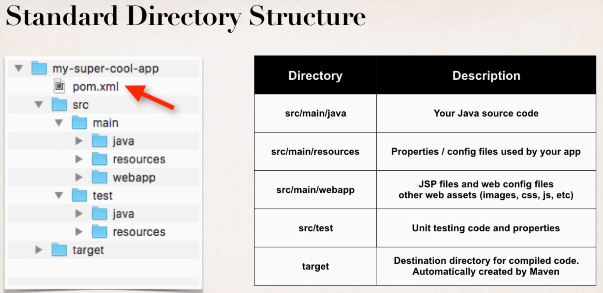
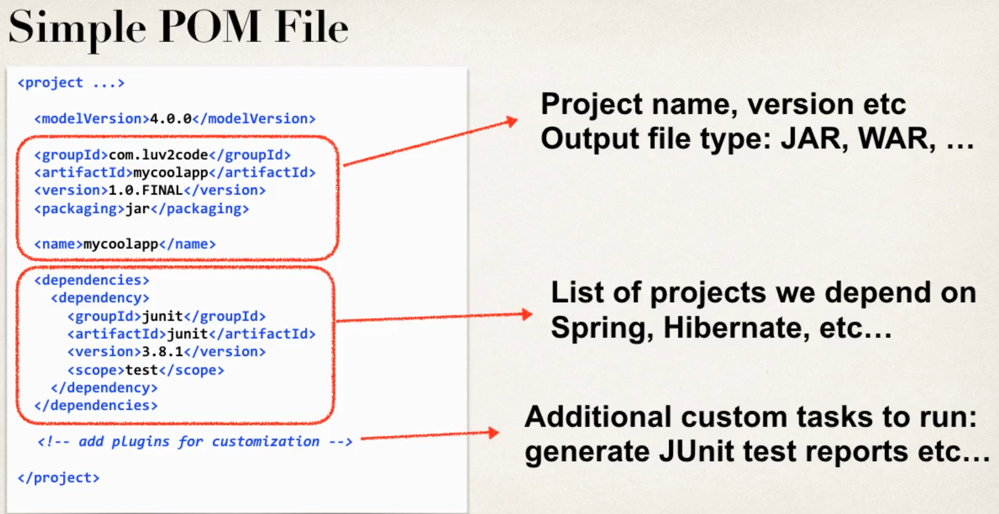
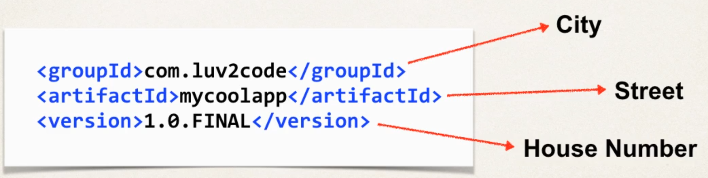

# Maven

* Project management tool for build management and dependencies
* Automatically download and add .jar files to classpath
* For that Maven has its own Repository
* We give Maven a shopping list, and it "buys" all the dependencies
  * Maven will read config file (shopping list)
  * Maven will check local repo.
  * If not local available, it will pull the dependencies from maven repo.

## Standard directory structure

## Key concepts

* Pom file
  * Project Object Model file (shopping list)
  * Located in root of project

* Project Coordinates to identify project
  * ``Group ID``: Name of company, convention is to use reverse domain: ``com.dstoecklein``
  * ``Artifact ID``: Name for this project ``coolapp``
  * ``Version`` (optional): If project under active development: ``1.0-SNAPSHOT``

# Archetypes

* Can be used to create new Maven projects
* A collection of "starter files" for a project, like Java project, Web project etc.
* Common archetypes:
  * maven-archetype-quickstart: Generate sample Maven project
  * maven-archetype-webapp: Sample Maven webapp
  * ...

# Maven private repositories

* Only available within organization, needs Maven server for example:
  * **JFrog**
  * Sonatype
  * Apache
  * ...
* Or use cloud hosted solutions
  * packagecloud.io
  * mymavenrepo.com
  * ...