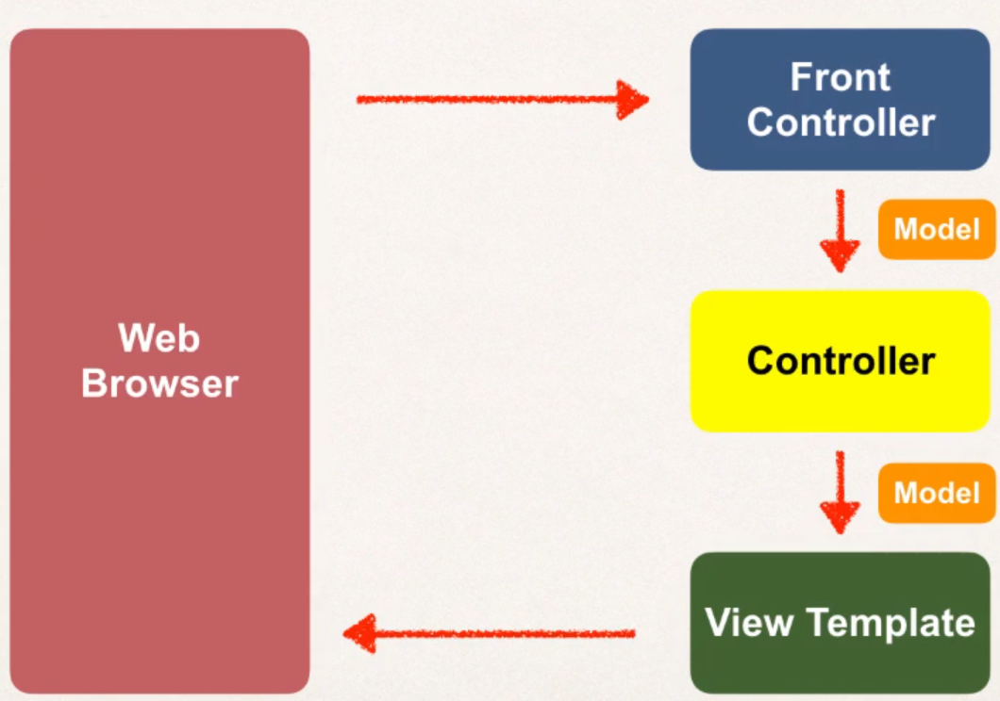
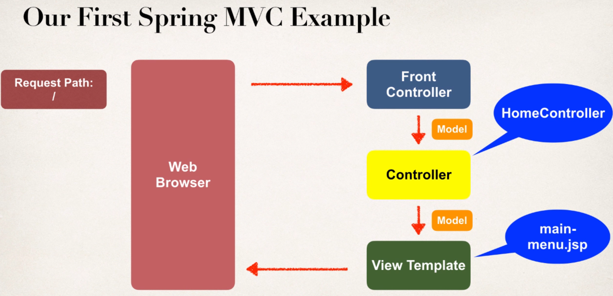
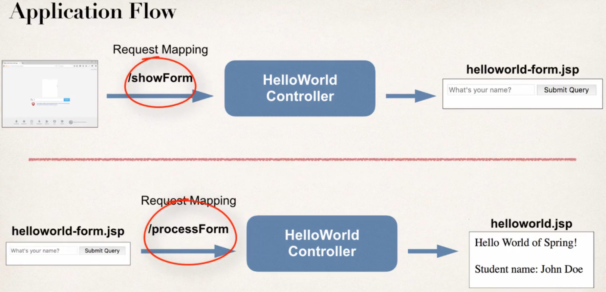
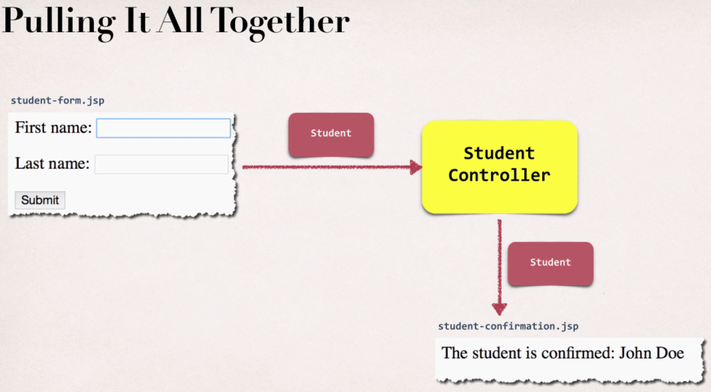
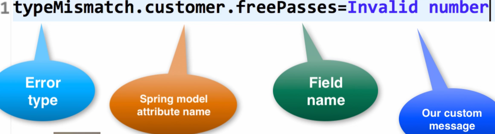

# Spring MVC
* Framework for building web applications in Java.
* Based on Model-View-Controller design pattern
* Leverage features of the Core Spring Framework (Inversion of Control, Dependency Injection)
* Incoming request -> Front controller delegates request to controller -> create a model -> pass that model to view template (HTML page) -> show view template in browser

## Benefits
* Spring way of building web app UIs in Java
* Reusable UI components
* Help manage app state for requests

# Behind the scenes of Spring MVC
Components:
* A set of web pages (UI components)
* A collection of Spring beans
* Spring configuration (XML, Annotations or Java)

Everything starts off with an incoming request.



### Front controller
* Known as **DispatcherServlet**
* Delegates request to the other objects
* Part of Spring Framework, already developed by Spring dev team

### Controller
* Handles request
* Store/retrieve data (db, web services)
* Place data in model

### Model
* Contains your data
* Place data in the model
* Data can be Java object / collection

### View template
* Displays data
* Most common is JSP + JSTL
  * Other templates are: Thymeleaf, Groovy, Velocity, ...

# Spring MVC configuration (most complicated/important)

## Part 1
* Add configurations to file: ``WEB-INF/web.xml``
  * Configure Spring MVC Dispatcher-Servlet (Remember: Its part of Spring)
  * Set up URL mappings to Spring MVC Dispatcher-Servlet

````xml
<web-app>
  <servlet>
    <servlet-name>dispatcher</servlet-name>
    <servlet-class>org.springframework.web.servlet.DispatcherServlet</servlet-class>
  
    <init-param>
      <param-name>contextConfigLocation</param-name>
      <param-value>/WEB-INF/spring-mvc-demo-servlet.xml</param-value>
    </init-param>
    
    <load-on-startup>1</load-on-startup>
  </servlet>

  <servlet-mapping>
    <servlet-name>dispatcher</servlet-name>
    <url-pattern>/</url-pattern>
  </servlet-mapping>
</web-app>
````
``servlet-name`` must match in mapping: ``dispatcher``

## Part
* Add configurations to file: ``WEB-INF/spring-mvc-demo-servlet.xml``
  * Add support for Spring component scanning
  * Add support for conversion, formatting and validation
  * Configure Spring MVC View Resolver

````xml
<beans>
  <!-- Add support for Spring component scanning -->
  <context:component-scan base-package="com.dstoecklein.springdemo" />
  <!-- Add support for conversion, formatting and validation -->
  <mvc:annotation-driven/>
  <!-- Configure Spring MVC View Resolver -->
  <bean>
    class="org.springframework.web.servlet.view.InternalResourceViewResolver">
    <property name="prefix" value="/WEB-INF/view" />
    <property name="suffix" value=".jsp" />
  </bean>
</beans>
````

``InternalResourceViewResolver`` means: How are pages be rendered?

For example: We returned a view name of ``show-student-list``. Then Spring will automatically add the prefix and
suffix: ``/WEB-INF/view/show-student-list.jsp``.

# Our First MVC App


1. Create Controller class
  2. Annotate with ``@Controller``. It tells MVC that this class is a controller. It also inherits from ``@Component``, this will automatically picked up by component scanning.
3. Define Controller method
  4. In our case ``public String showPage()``
5. Add request mapping to controller method
  6. ``@RequestMapping("/")``. So we map the method to this root path. So when users to go on the website, they will see what we defined. It will handle all type of requests like ``GET`` or ``POST``.
7. Return View name
  8. ``return "main-menu"``. Based on the config file, it will look under the given ``prefix`` directory and will then append the ``suffix``.
9. Create the View page
  10. Just any regular HTML page

````java
@Controller
public class HomeController {

    @RequestMapping("/")
    public String showPage() {
        return "main-menu";
    }
}
````

# Read Form-Data with Spring MVC



The key here is to have one ``HelloWorldController`` with two different ``RequestMapping``.

````java
@Controller
public class HelloWorldController {
    @RequestMapping("/showForm")
    public String showForm() {
        return "helloworld-form";
    }
    
    @RequestMapping("/processForm")
    public String processForm() {
        return "helloworld";
    }
}
````

Step by step:
1. Create controller class
2. Show HTML form
  3. Create controller method to show HTML form
  4. Create View page for HTML form
5. Process HTML form
  6. Create controller
  7. Develop view page

# Adding data to the Spring model
* Model is a container for our application data
  * Strings, objects, info from database, ...
* View page (JSP) can access data from the model

1. Pass model to controller. In this example: Lets make name uppercase from input-field.

````java
@RequestMapping("/processFormVersionTwo")
public String letsShoutDude(HttpServletRequest request, Model model) {
    String theName = request.getParameter("studentName");
    theName = theName.toUpperCase();
    String result = "Yo! " + theName;
    model.addAttribute("message", result);
    return "helloworld";
}
````

2. Access data from model in view page
````html
<html><body>
Hello World!
...
The message: ${message}
</body></html>
````

# Bonus
Bonus: Deploying your App to Tomcat as a Web Application Archive (WAR) file

When you deploy your Java web apps, you can make use of a Web Application Archive (WAR) file.

The Web Application Archive (WAR) file is a compressed version of your web application. It uses the zip file format but the file has the .war extension.

If you are using Eclipse, then the best way to visualize it is think of your "WebContent" directory being compressed as a zip file with the .war extension.

This includes all of your web pages, images, css etc. It also includes the WEB-INF directory which includes your classes in WEB-INF/classes and supporting JAR files in WEB-INF/lib.

The WAR file format is part of the Java EE / Servlet specification. As a result, all Java EE servers support this format (ie jboss, weblogic, websphere, glassfish and tomcat).

Below, I provide steps on how to create a WAR file in Eclipse. I also show how to deploy the WAR file on Tomcat.

# Reading HTML Form data with ``@RequestParam``
* ... Instead of using ``HttpServletRequest``
* Spring will read param from request: ``studentName``
* Bind it to the variable: ``theName``

````java
    @RequestMapping("/processFormVersionThree")
public String processFormVersionThree(@RequestParam("studentName") String theName, Model model) {
        theName = theName.toUpperCase();
        String result = "Yo!! " + theName;
        model.addAttribute("message", result);
        return "helloworld";
}
````

# Add Controller ``@RequestMapping``
* You can define a request mapping at the controller-level
* All request mappings on methods in the controller are relative: Similar to folder directory structure
* So it would be: ``/funny/showForm``. Where ``/funny`` is controller mapping and ``/showForm`` method mapping.
* Great technique to group requests

````java
@RequestMapping("/funny")
public class FunnyController {
    @RequestMapping("/showForm")
    public String showForm() {
    }

    @RequestMapping("/processForm")
    public String process(HttpServletRequest request, Model model) {
    }
}
````

# Spring MVC Form Tags
* Spring MVC Form Tags are the building block for a web page
* Can make use of data binding
* Automatically setting / retrieving data from Java objects / beans
* Will generate HTML for you + some special features
* Put in JSP page
  * To reference Form Tags make use of: ``<%@ taglib prefix="form" uri="..."%>`` in JSP file
* Examples
  * form:form
  * form:input
  * form:textarea
  * form:checkbox
  * ...

``StudentController``
* New Student Object is passed to the Form
````java
@RequestMapping("/showForm")
public String showForm(Model theModel) {
    theModel.addAttribute("student", new Student());
    return "student-form";
        }
````

``form.jsp``
* When Form is loaded, Spring will call: ``student.getFirstName()`` (reference to ``path="firstName"``)
* When Form is submited, Spring will call: ``student.setFirstName()``
````html
<form:form action="processForm" modelAttribute="student">
    First name: <form:input path="firstName" />
    <br><br>
    Last name: <form:input path="lastName" />
    <br><br>
    <input type="submit" value="Submit" />
</form:form>
````

Read form in ``StudentController``:
* ``@ModelAttribute`` is bind to the above ``modelAttribute="student"``. Spring will take the model attribute and bind it to the variable ``theStudent``.
* No more ``request.getParamter`` needed.
````java
@RequestMapping("/processForm")
public String processForm(@ModelAttribute("student") Student theStudent) {
    System.out.println("theStudent: " + theStudent.getLastName());
    return "student-confirmation";
        }
````

``student-confirmation``
````html
<html>
<body>
The student is confirmed: ${student.firstName} ${student.lastName}
</body>
</html>
````



# Dropdown list
````html
<form:select path="country">
    <form:option value="Brazil" label="Brazil" />
    <form:option value="USA" label="USA" />
</form:select>
````

# Radio Buttons
````html
Java <form:radiobutton path="favoriteLanguage" value="Java" />
Perl <form:radiobutton path="favoriteLanguage" value="Perl" />
Python <form:radiobutton path="favoriteLanguage" value="Python" />
````

# Check Boxes
````html
Linux <form:checkbox path="operatingSystems" value="Linux" />
Windows <form:checkbox path="operatingSystems" value="Windows" />
MacOS <form:checkbox path="operatingSystems" value="MacOS" />
````

# Spring MVC Form Validation
* Validate the Fields in the Form (range, format, custom rule, ...)
* Java has standard bean validation API
* Spring version 4 and higher supports Bean Validation API (preferred)
* Examples
  * ``@NotNull``
  * ``@Min``, ``@Max``
  * ``@Size``
  * ``@Pattern`` for regex
  * ...

1. Setting up Environment
  2. We need an implementation of Java's standard Bean Validation API (JSR-303)
3. Here comes Hibernate into play
  4. Has a separate project just for doing validation (Hibernate validator)
5. Jakarte EE
  6. Community implementation of Java EE, so not maintained by Oracle
  7. Important: ``javax.*`` packages are renamed to ``jakarta.*``
  8. Hibernate Validator 7 is based on Jakarta EE 9
  9. Spring 5 is still bases on Java EE (javax.*)
  10. Spring 5 is not compatible with Hibernate Validator 7 (use Hibernator 6.2)

* If using Spring 5, use Hibernate Validator 6.2
* If using Spring Jakarta EE 9, use Hibernator Validator 7

## Required Fields
* E.g. last name is required

1. Add validation rule to Customer class
2. Display error Message on HTML form
3. Perform validation in Controller class
4. Update confirmation page

Add validation rule to Customer class

````java
public class Customer {
    private String firstName;
    
    @NotNull(message="is required")
    @Size(min=1, message="is required") // minimum of 1 char
    private String lastName;
}
````

Display error Message on HTML form
````html
<form:form action="processForm" modelAttribute="customer">
    First name: <form:input path="firstname" />
    
    Last name (*): <form:input path="lastName" />
    <form:errors path="lastName" cssClass="error" />
    ...
</form:form>
````

Perform validation in Controller class
* ``@Valid``: Perform validation rules on ``Customer`` object
* ``BindingResult``: Result of that validation will be placed in here
````java
@RequestMapping("/processForm")
public String processForm(@Valid @ModelAttribute("customer") Customer theCustomer, BindingResult theBindingResult) {
    if (theBindingResult.hasErrors()) {
        return "customer-form";
    else {
        return "customer-confirmation";
        }    
    }
}
````

Update confirmation page
````html
<html>
<body>
confirmed: ${customer.firstName} ...
</body>
</html>
````

# Spring MVC Validation for Numbers

Steps are the same as above
````java
public class Customer {
    @Min(value=0, message="must be greater than 0")
    @Max(value=10, message="must be less than 10")
    private int freePasses;
    ...
}
````

No modifications needed in ``CustomerController``

# Spring MVC Validation with Regular Expressions
* e.g. to validate postal code. We apply a pattern.

Steps are the same as above
````java
public class Customer {
    @Pattern(regexp="^[a-zA-Z0-9]{5}", message="only 5 chars/digits")
    private String postalCode;
    ...
}
````

# Make an Integer Field "required"
* Cant use ``@NotNull()`` with ``int``. Instead use Wrapper class ``Integer``

````java
@NotNull(message = "is required")
private Integer freePasses;
````

* Also update getter/setter
````java
public Integer getFreePasses() {
    return freePasses;
}

public void setFreePasses(Integer freePasses) {
    this.freePasses = freePasses;
}
````

# Handle String-input for Integer fields
So we only can give digits as input

1. Create a custom error message
  2. ``src/resources/messages.properties``
3. Load custom messages resource in Spring config file
  4. ``WebContent/WEB-INF/spring-mvc-demo-servlet.xml``

Create a custom error message


Load custom messages resource in Spring config file
````xml
<bean id="messageSource" class="org.springframework.context.support.ResourceBundleMessageSource">
    <property name="basenames" value="resources/messages"/>
</bean>
````

# Spring MVC Custom Validation
* Custom Business rules, e.g. Course Code must start with "LUV"
* Own Custom Annotation, e.g. ``@CourseCode``

````java
@CourseCode(value="LUV", message="must start with LUV")
private String courseCode;
````

1. Create custom validation rule:
  2. Create ``@CourseCode`` Annotation
  3. Create ``CourseCodeConstraintValidator`` (our own custom logic)

* ``@interface`` special type of interface to create a custom annotation in Java
* ``@Constraint`` constraint that is validated by a class with given business rules / logic
* ``@Target`` where can we apply this annotation? Here we can use it to a method or field
* ``@Retention`` how long should we retain the annotation? Here, runtime so we can inspect it at runtime

``src/com.dstoecklein.springdemo.mvc.validation``

``CourseCode.java``

````java
@Constraint(validatedBy = CourseCodeConstraintValidator.class)
@Target( { ElementType.METHOD, ElementType.FIELD } )
@Retention(RetentionPolicy.RUNTIME)
public @interface CourseCode {
    // define default course code
    public String value() default "LUV";
    
    // define default error message
    public String message() default "must start with LUV";
}
````

2. Create ``CourseCodeConstraintValidator``

``src/com.dstoecklein.springdemo.mvc.validation``

``CourseCodeConstraintValidator.java``

````java
public class CourseCodeConstraintValidator implements ConstraintValidator<CourseCode, String> {
  private String coursePrefix;

  @Override
  public void initialize(CourseCode theCourseCode) {
    coursePrefix = theCourseCode.value(); // gives me value from @CourseCode(value="LUV", message="")
  }

  // Spring MVC will call this at runtime
  // ConstraintValidatorContext is a helper class to add messages later
  @Override
  public boolean isValid(String theCode, ConstraintValidatorContext theConstraintValidatorContext) {
    boolean result;

    if (theCode != null) {
      // does it start with "LUV"?
      result = theCode.startsWith(coursePrefix);
    }
    else {
      // if course code is empty, return true
      result = true;
    }

    return result;
  }
}
````