# REST

## Business Problem
* We try to build a client app that provides weather report for a city, so we need to get weather data from an external service.

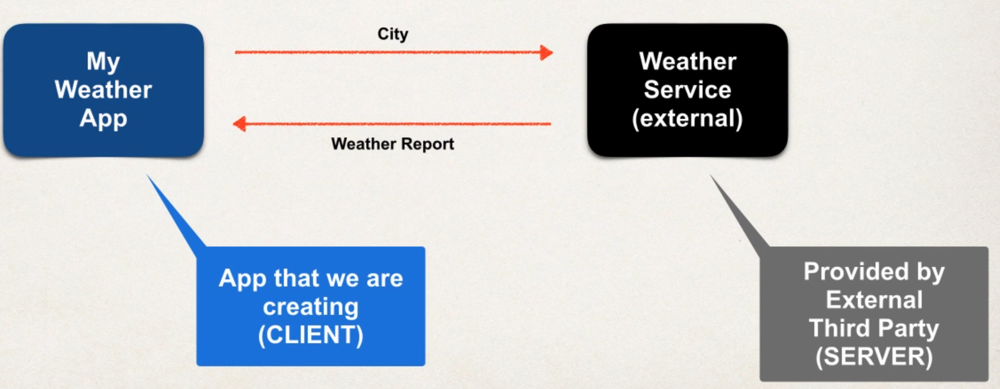

### Questions
* How will we connect to the weather service? 
* We make REST API calls over HTTP
* What Programming language we use?
* REST is language independent
* What is the data format?
* REST can use any data format (JSON most popular)

### Possible Solution
* Use API of openweathermap.org

Request

````text
api.openweathermap.org/data/2.5/weather?q={city}
````

Response

````json
{
  "temp": 14,
  "temp_min": 9,
  ...
}
````

### Remember
* All we need to care about is that the programming language we are using can process the data format we are getting back.

### Dont get confused...
* REST API, RESTful API, REST Web Services, ... are all the same

## JSON
* Curley braces define objects
* Object members are name / value pairs
* Name is always in ""

````json
{
  "temp": 14,
  "temp_min": 9,
  "address": {
    "street": "Lerchenstraße",
    ...
  },
  ...
}
````

## Java JSON Data Binding
* Data binding is the process of converting JSON to Java POJO (Plain old Java Class)and vice versa.
  * Also known as mapping / serialization, marshalling... its all the same
* Spring uses the Jackson Project behind the scenes
* Jackson handles data binding between JSON and Java POJO
  * https://github.com/FasterXML/jackson-databind
* In conversion, Jackson will call appropriate getter / setters. It does NOT access private fields directly!

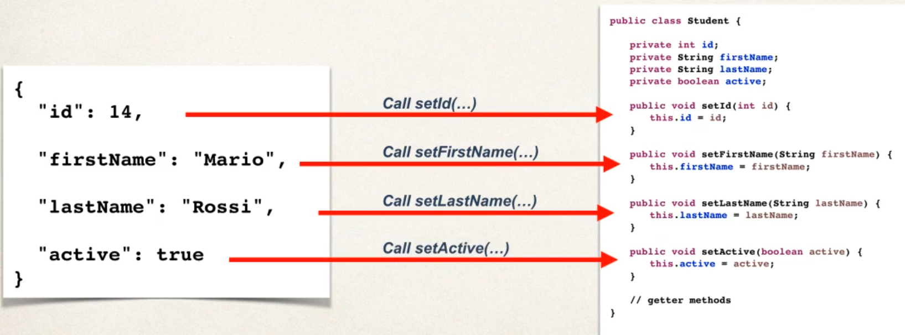

````java
import com.fasterxml.jackson.databind.ObjectMapper;

public class Driver {
    public statis void main(String[] args) throws Exception {
        ObjectMapper mapper = new ObjectMapper();

        // Read data from json file, create an instance of this class and populate it
        Student myStudent = mapper.readValue(new File("data/sample.json"), Student.class);
  }
}
````

Vice versa:

````java
import com.fasterxml.jackson.databind.ObjectMapper;

public class Driver {
    public statis void main(String[] args) throws Exception {
        ObjectMapper mapper = new ObjectMapper();

        // Read data from json file, create an instance of this class and populate it
        Student myStudent = mapper.readValue(new File("data/sample.json"), Student.class);

        mapper.enable(SerializationFeature.INDENT_PUTPUT); // just prettier writing
        mapper.writeValue(new File("data/output.json"), myStudent);
    }
}
````

## Spring & Jackson
* When building Spring REST apps, Spring will automatically handle Jackson integration
* JSON data being passed to REST controller is converted to POJO
* Java object being returned from REST controller is converted to JSON

### Ignore JSON properties that we don't want to use

````java
@JsonIgnoreProperties(ignoreUnknown = true)
public class Student {
  ...
}
````

## HTTP
* Most common use of REST is over HTTP
* CRUD operations
  * POST (Create new entity)
  * GET (Read a list of entities)
  * PUT (Update entity)
  * DELETE (Delete entity)

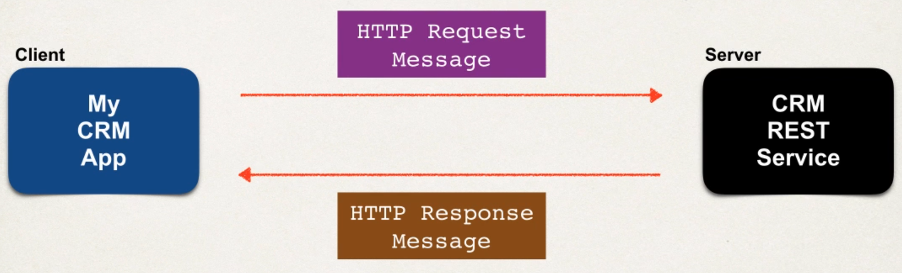

### What's in the messages?
* Request Message
  * Request line: HTTP command
  * Header variable: Request metadata
  * Message body: contents of message as JSON
* Response Message
  * Response line: Server protocol and status code (404, 500, etc)
  * Header variable: Response metadata (if its XML or JSON, ...)
  * Message body: contents of message
* MIME Content Types
  * Message format is described by MIME content type (Multipurpose Internet Mail-Extension)
  * Basic syntax: ``type/sub-type``
  * Examples: ``text/html`` or ``text/plain``. Browser will render based on HTML tags or will just render plain text.
* Client-Tool
  * Curl
  * Postman
  * ...

## Spring REST Controller
* ``@RestController`` its an extension of ``Controller``
* Handles REST requests and response
* Will automatically convert Java POJOs to JSON
  * as long as Jackson project is on the classpath or pom.xml

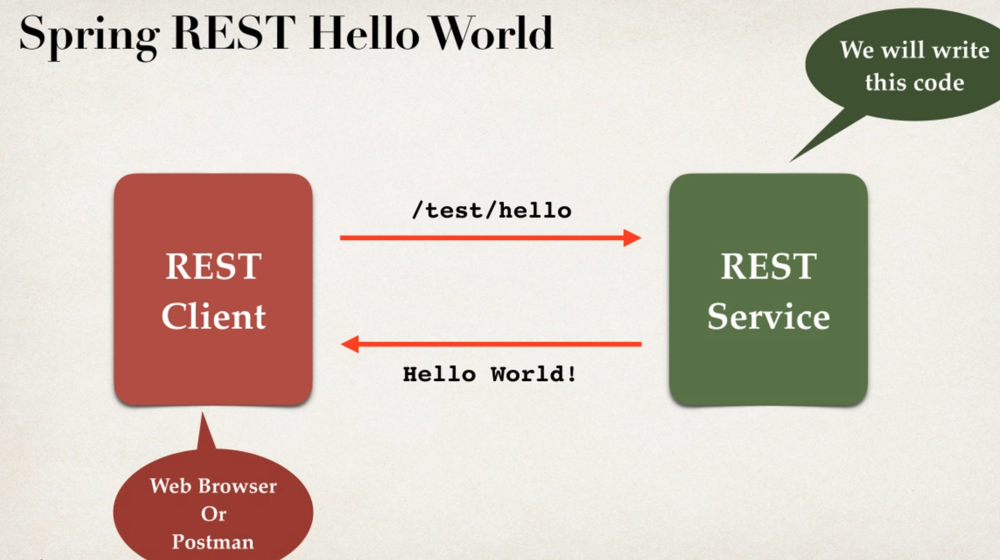

````java
@RestController
@RequestMapping("/test")
public class DemoRestController {
    
    @GetMapping("/hello")
    public String sayHello() {
        return "Hello World";
    }
}
````

* Access REST endpoint at ``/test/hello``

### Development Process
* Add Maven / Gradle dependency for Spring MVC and Jackson
* Add code for Java Config: ``@Configuration``
* Add code for Java Config: Servlet Initializer
* Create Spring REST Service using ``@RestController``

Add Maven / Gradle dependency for Spring MVC and Jackson

...

Add code for Java Config: ``@Configuration``

````java
@Configuration
@EnableWebMvc
@ComponentScan(basePackages="com.dstoecklein.springdemo")
public class DemoAppConfig {
  ...
}
````

Add code for Java Config: Servlet Initializer

````java
public class MySpringMvcDispatcherServletInitializer extends AbstractAnnotationConfigDispatcherServletinitializer {
    
    @Override
    protected Class<?>[] getRootConfigClasses() {
        return null;
    }
    
    @Override
    protected Class<?>[] getServletConfigClasses() {
        return new Class[] { DemoAppConfig.class };
    }
    
    @Override
    protected String[] getServletMappings() {
        return new String[] { "/" };
    }
}
````

Create Spring REST Service using ``@RestController``

````java
@RestController
@RequestMapping("/test")
public class DemoRestController {

  @GetMapping("/hello")
  public String sayHello() {
    return "Hello World";
  }
}
````

## Creating a REST Service
* We are going to create a Service for Students
* We will make GET Requests via Postman on this Service

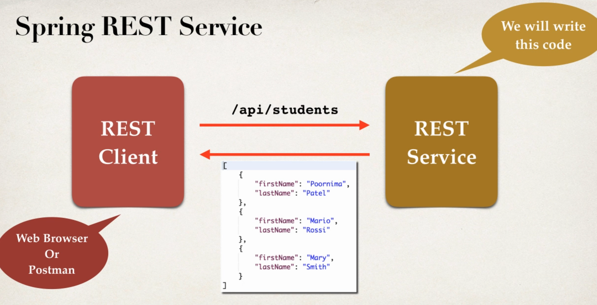

* Will return ``List<Student>``, need to convert to JSON with Jackson
* If Jackson is a dependency via Maven or Gradle, then
  * JSON data passed to a ``@RestController`` is automatically converted to POJO
  * POJO passed to a ``@RestController`` is automatically converted to JSON

### Development Process
* Create Java POJO Class for Students (we have done this earlier)
* Create ``@RestController``

````java
@RestController
@RequestMapping("/api")
public class StudentRestController {
    
    @GetMapping("/students")
    public List<Student> getStudents() {
        List<Student> theStudents = new ArrayList<>();
        
        // hardcoded for now
        thestudents.add(new Student("Max", "Müller"));
        thestudents.add(new Student("Bob", "Allh"));
        
        return theStudents;
    }
}
````

## Path Variables
* Retrieve a single Student by id ``/api/students/{studentId}``, that ``studentId`` is called PathVariable

### Development Process
* Add request mapping to our Service
* Bind path variable using ``@PathVariable``

````java
@RestController
@RequestMapping("/api")
public class StudentRestController {
    
    @GetMapping("/students/{studentId}")
    public Student getStudent(@PathVariable int studentId) {
        List<Student> theStudents = new ArrayList<>();
        //populate theStudents
    }
    return theStudents.get(studentId);
}
````

## Exception Handling
* If we passed over a bad studentId, we received a ``Status 500`` error
* We dont want that, because it exposes a lot of sensitive data
* We want to return error as JSON instead

````json
{
  "status": 404,
  "message": "Student id not found",
  "timeStamp": 15261454867
}
````

### Development process
* Create custom error response class
* Create custom exception class
* Update REST service to throw exception
* Add an exception handler method using ``@ExceptionHandler``

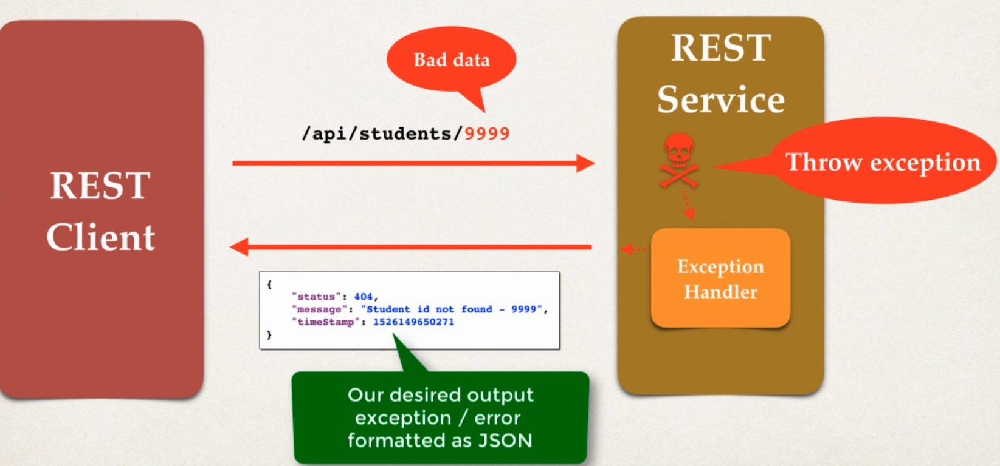

Create custom error response class (we will define it as POJO)
````java
public class StudentErrorResponse {
    private int status;
    private String message;
    private long timeStamp;
    
    // constructor + getter/setter
}
````

Create custom exception class (will be used by our REST service)
````java
public class StudentNotFoundException extends RuntimeException {
    public StudentNotFoundException(String message) {
        super(message);
    }
}
````

Update REST service to throw exception
````java
@RestController
@RequestMapping("/api")
public class StudentRestController {
    
  ...
  
  if ( (studentId >= theStudents.size() ) || (studentId < 0) ) {
      throw new StudentNotFoundException("Student id not found - " + studentId);
  }
  
  // Happy Path
  return theStudents.get(studentId); 
}
````

Add an exception handler method using ``@ExceptionHandler`` (Will response a ``ResponseEntity`` which is a wrapper for the HTTP response object)

````java
@RestController
@RequestMapping("/api")
public class StudentRestController {
    
  ...
  
  @ExceptionHandler
  public ResponseEntity<StudentErrorResponse> handleException(StudentNotFoundException exc) {
      StudentErrorResponse error = new StudentErrorResponse();
      
      error.setStatus(HttpStatus.NOT_FOUND.value());
      error.setMessage(exc.getMessage());
      error.setTimeStamp(System.currentTimeMillis());
      
      return new ResponseEntity<>(error, HttpStatus.NOT_FOUND);
  }
}
````

### Edge cases
* What happens if we enter a String: ``/api/students/fdsjflsd``
  * It will return ``400 Bad Request``

````java
@RestController
@RequestMapping("/api")
public class StudentRestController {
    
  ...
  
  // add another handler to catch all
  @ExceptionHandler
  public ResponseEntity<StudentErrorResponse> handleException(Exception exc) {
      StudentErrorResponse error = new StudentErrorResponse();
  
      error.setStatus(HttpStatus.BAD_REQUEST.value());
      error.setMessage(exc.getMessage());
      error.setTimeStamp(System.currentTimeMillis());

    return new ResponseEntity<>(error, HttpStatus.BAD_REQUEST);
  }
}
````

## Global Exception Handling
* Exception handler code is only for the specific REST controller
* Cant be reused by other controllers, like in large projects
* We can make use of ``@ControllerAdvice``
  * Pre-process requests to controller
  * Post-process responses to handle exception
  * Real-time use of AOP

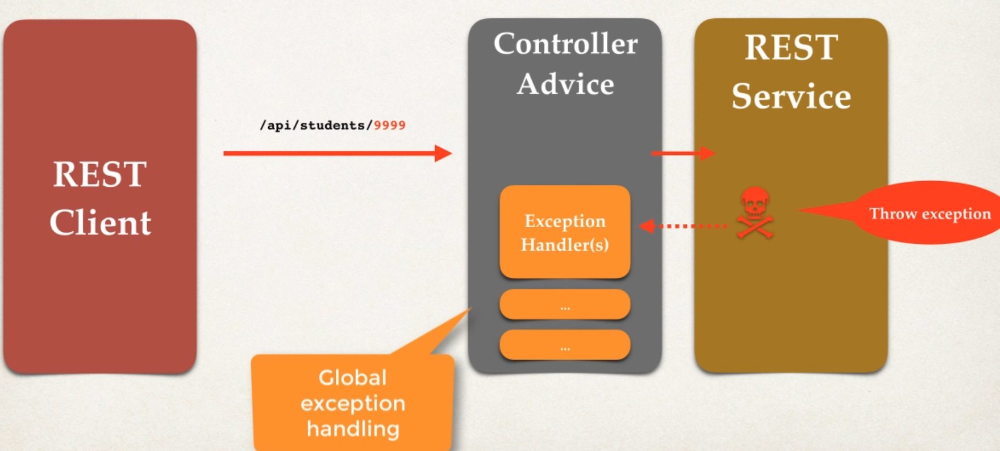

### Development process
* Create new ``@ControllerAdvice``
* Refactor our REST service to remove exception handling code
* Add exception handling code to ``@ControllerAdvice``

Create new ``@ControllerAdvice``
````java
@ControllerAdvice
public class StudentRestExceptionHandler {
  ...
}
````

Refactor our REST service to remove exception handling code

...

Add exception handling code to ``@ControllerAdvice``
````java
@ControllerAdvice
public class StudentRestExceptionHandler {

  @ExceptionHandler
  public ResponseEntity<StudentErrorResponse> handleException(StudentNotFoundException exc) {
    StudentErrorResponse error = new StudentErrorResponse();

    error.setStatus(HttpStatus.NOT_FOUND.value());
    error.setMessage(exc.getMessage());
    error.setTimeStamp(System.currentTimeMillis());

    return new ResponseEntity<>(error, HttpStatus.NOT_FOUND);
  }
}
````

## REST API Design
* Who and how will they use our API -> Design based on this
* E.g. for a CRM system
  * Full CRUD support for our Customers
  * Most prominent "noun" is "customer"
  * Endpoint convention: ``customer``

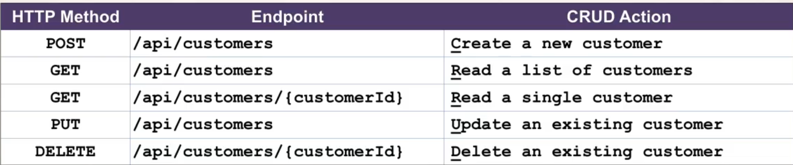

### Anti-Patterns
* Don't include actions in the endpoint
  * Instead, use HTTP methods to assign actions
  * Above, our endpoints don't have any actions in the names

### Examples
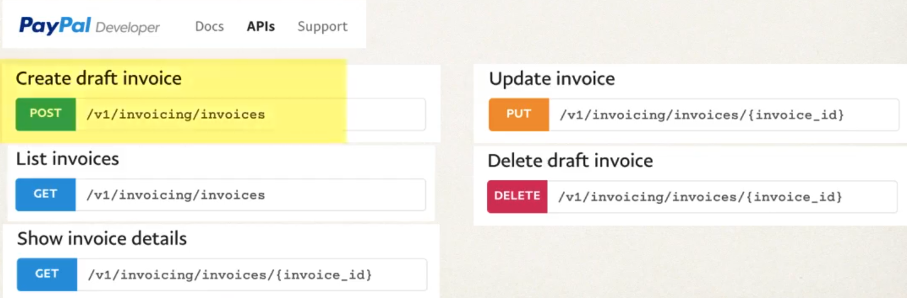

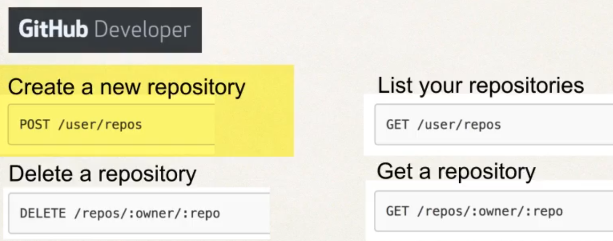

## CRUD Project

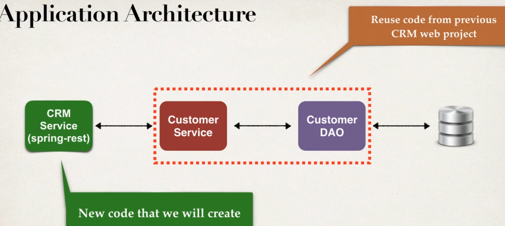

### Development Process
* Get customers
* Get single customer by ID
* Add a new customer
* Update customer
* Delete customer


